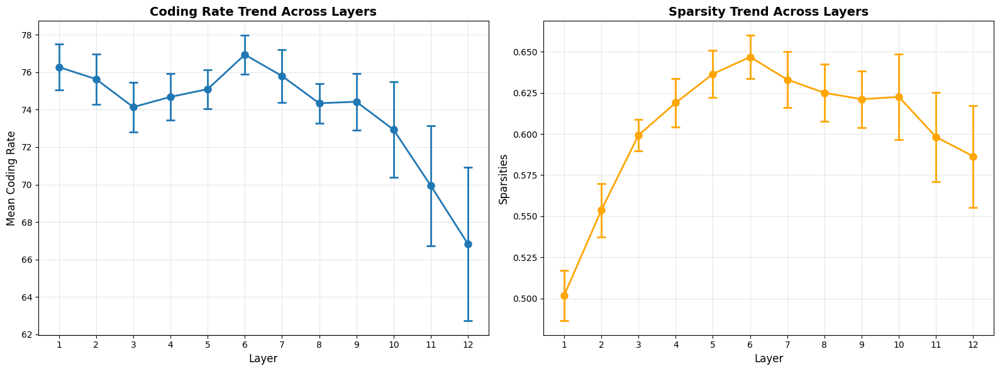
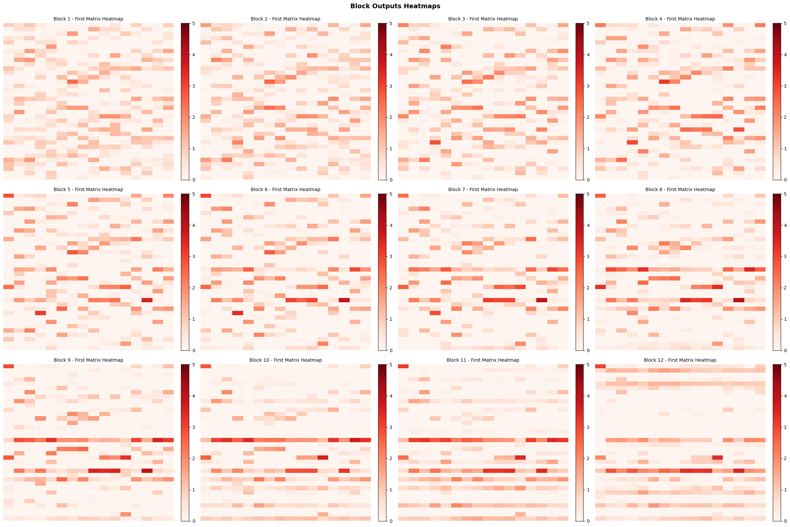
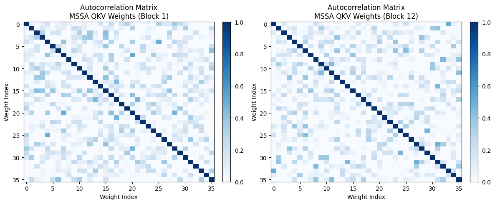
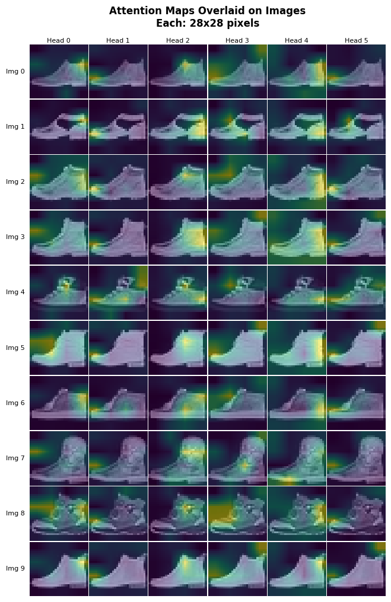
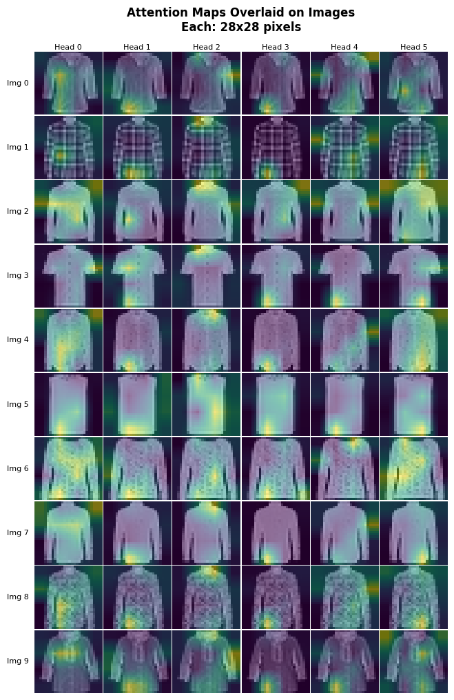

# CRATE on Fashion-MNIST

A PyTorch implementation of the [CRATE](https://arxiv.org/abs/2206.04611) (Coding RAte reduction TransformEr) architecture for image classification on [Fashion-MNIST](https://github.com/zalandoresearch/fashion-mnist), together with an exploratory notebook that inspects what the model learns inside each block.

The main walkthrough lives in [`notebooks/crate_explained_fashion.ipynb`](notebooks/crate_explained_fashion.ipynb). The Python package under `models/` and `utils/` provides reusable building blocks (`CRATEClassification`, `CRATEEncoder`, MSSA, ISTA, metrics, and visualization helpers).

## What this repo does

1. **Train CRATE for classification** — Patch-embed 28×28 grayscale images, run them through a stack of CRATE encoder blocks (LayerNorm → MSSA → LayerNorm → ISTA), and classify with a CLS token head.
2. **Study representation structure** — Measure coding rate and sparsity across layers, and visualize how token representations become increasingly low-rank and sparse.
3. **Inspect MSSA subspaces** — Plot autocorrelation of normalized MSSA QKV weights to see how attention subspaces decorrelate across depth.
4. **Interpret attention heads** — Overlay per-head CLS attention maps on input images to reveal what each head attends to.

## Architecture (brief)

Each CRATE block alternates:

- **MSSA** (Multi-Scale Self-Attention) — compresses tokens toward learned subspaces $U_{[K]}^{\ell}$
- **ISTA** (Iterative Shrinkage-Thresholding) — promotes sparse token representations

```
Image → Patch Embedding (+ CLS) → [LN → MSSA → LN → ISTA] × L → Classification Head
```

See [`models/crate_encoder.py`](models/crate_encoder.py) and [`models/crate_classification.py`](models/crate_classification.py) for the implementation.

## Visualizations from the notebook

The figures below are taken from executed outputs in `notebooks/crate_explained_fashion.ipynb` (trained checkpoint: ~86% test accuracy on Fashion-MNIST).

### Low-rankness and layer-wise compression

Coding rate decreases from early to late layers, indicating tokens are progressively compressed into their subspaces. Sparsity rises through the network, showing ISTA pushes representations toward sparse codes.



Block-output heatmaps show representations becoming more structured and low-rank in deeper layers (horizontal structure emerges as depth increases).



### Autocorrelation of MSSA subspaces

Autocorrelation matrices of normalized MSSA QKV weights compare early vs. late blocks. Off-diagonal mass stays low, while the diagonal stays strong—subspaces remain largely incoherent across heads/dimensions, with subtle sharpening in deeper layers.



### Semantic meaning of attention heads

CLS attention maps overlaid on Fashion-MNIST images (10 samples × 6 heads). Different heads specialize on different regions (e.g. toe, heel, upper boot) even though training only uses class labels.

**Block 1 (early layer)**



**Block 8 (deeper layer)**



## Project layout

```
crate_implementation/
├── models/                  # CRATE encoder & classification model
├── utils/                   # Coding rate, sparsity, hooks, visualization
├── notebooks/
│   ├── crate_explained_fashion.ipynb
│   └── configs/             # YAML model configs (crate_small_deep, etc.)
└── docs/images/             # README figures exported from the notebook
```

## Getting started

**Requirements:** Python ≥ 3.10, PyTorch, torchvision, einops, matplotlib, PyYAML (see [`pyproject.toml`](pyproject.toml)).

```bash
# Install dependencies (uv recommended)
uv sync

# Open the notebook
jupyter notebook notebooks/crate_explained_fashion.ipynb
```

Training downloads Fashion-MNIST to `notebooks/data/` and saves checkpoints under `notebooks/checkpoints/`. Set `resume_from_checkpoint` in the notebook to load weights instead of training from scratch.

## References

- CRATE paper: [White-Box Transformers via Sparse Rate Reduction](https://arxiv.org/abs/2206.04611)
- Textbook context: *Learning Deep Representations of Data Distribution* (derivation of transformer-like architectures from compressive objectives)
